# devops-prompts

A collection of DevOps-specific prompts for infrastructure management, CI/CD, Kubernetes, monitoring, and operational tasks. Designed for use by SREs, platform engineers, and DevOps teams.

## Architecture

```mermaid
flowchart TD
    A[devops-prompts] --> B[Terraform]
    A --> C[Kubernetes]
    A --> D[CI/CD]
    A --> E[Monitoring]
    A --> F[Templates]

    B --> B1[Module Review]
    B --> B2[Migration Planning]

    C --> C1[Troubleshooting]
    C --> C2[Optimization]

    D --> D1[Pipeline Design]
    D --> D2[Security Scanning]

    E --> E1[Alert Tuning]
    E --> E2[Dashboard Design]

    F --> F1[Base Prompt]
    F --> F2[Incident Template]

    style A fill:#2ECC71,stroke:#1A9B52,color:#FFFFFF
    style B fill:#8E44AD,stroke:#6C3483,color:#FFFFFF
    style C fill:#3498DB,stroke:#2476AB,color:#FFFFFF
    style D fill:#E67E22,stroke:#C46A1D,color:#FFFFFF
    style E fill:#E74C3C,stroke:#B83A2F,color:#FFFFFF
    style F fill:#1ABC9C,stroke:#148F77,color:#FFFFFF
    style B1 fill:#A569BD,stroke:#8E44AD,color:#FFFFFF
    style B2 fill:#A569BD,stroke:#8E44AD,color:#FFFFFF
    style C1 fill:#5DADE2,stroke:#3498DB,color:#FFFFFF
    style C2 fill:#5DADE2,stroke:#3498DB,color:#FFFFFF
    style D1 fill:#F0B27A,stroke:#E67E22,color:#FFFFFF
    style D2 fill:#F0B27A,stroke:#E67E22,color:#FFFFFF
    style E1 fill:#EC7063,stroke:#E74C3C,color:#FFFFFF
    style E2 fill:#EC7063,stroke:#E74C3C,color:#FFFFFF
    style F1 fill:#48C9B0,stroke:#1ABC9C,color:#FFFFFF
    style F2 fill:#48C9B0,stroke:#1ABC9C,color:#FFFFFF
```



## Structure

```
devops-prompts/
  prompts/
    terraform/
      module-review.md        # Terraform module review checklist
      migration.md            # State and version migration planning
    kubernetes/
      troubleshooting.md      # Systematic K8s issue diagnosis
      optimization.md         # Resource and cost optimization
    ci-cd/
      pipeline-design.md      # CI/CD pipeline architecture
      security-scanning.md    # DevSecOps scanning integration
    monitoring/
      alert-tuning.md         # Alert noise reduction and optimization
      dashboard-design.md     # Effective dashboard creation
  templates/
    base-prompt.md            # Foundational DevOps prompt template
    incident-template.md      # Incident response prompt template
```

## Usage

Each prompt file includes:

1. **Purpose** - What the prompt is designed to accomplish
2. **System Prompt** - Role definition for the assistant
3. **Prompt Template** - Main template with `{placeholders}` to fill in
4. **Variations** - Alternative versions for specific scenarios
5. **Checklists** - Quick reference verification lists

### Example

To use the Terraform module review prompt:

1. Open `prompts/terraform/module-review.md`
2. Copy the prompt template
3. Replace `{code}` with your Terraform module
4. Replace `{provider}`, `{version}`, etc. with your specifics
5. Use the filled-in prompt with your preferred assistant

## Prompt Categories

| Category | Focus Area | Key Use Cases |
|----------|-----------|---------------|
| Terraform | Infrastructure as Code | Module reviews, migrations, refactoring |
| Kubernetes | Container orchestration | Troubleshooting, optimization, scaling |
| CI/CD | Build and deployment | Pipeline design, security integration |
| Monitoring | Observability | Alert tuning, dashboard design, SLOs |

## Contributing

1. Follow the existing prompt structure (Purpose, System Prompt, Template, Variations)
2. Include practical, real-world scenarios
3. Test prompts with representative inputs
4. Add checklists where applicable

## License

MIT License - see [LICENSE](LICENSE) for details.
